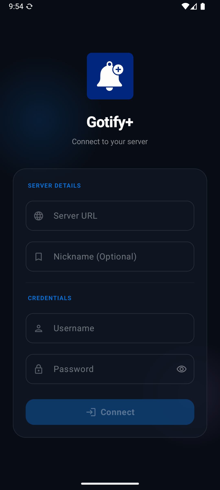
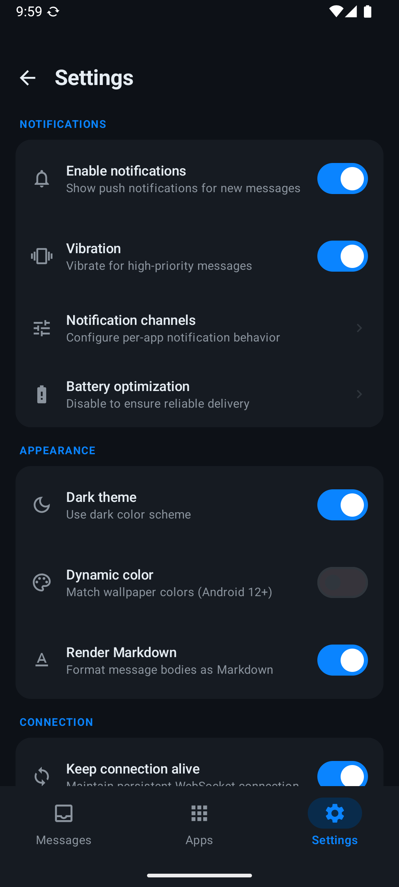
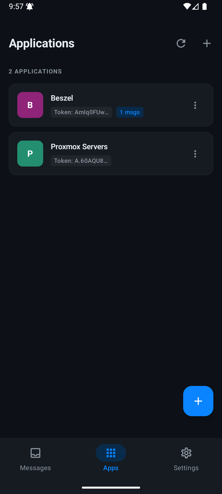
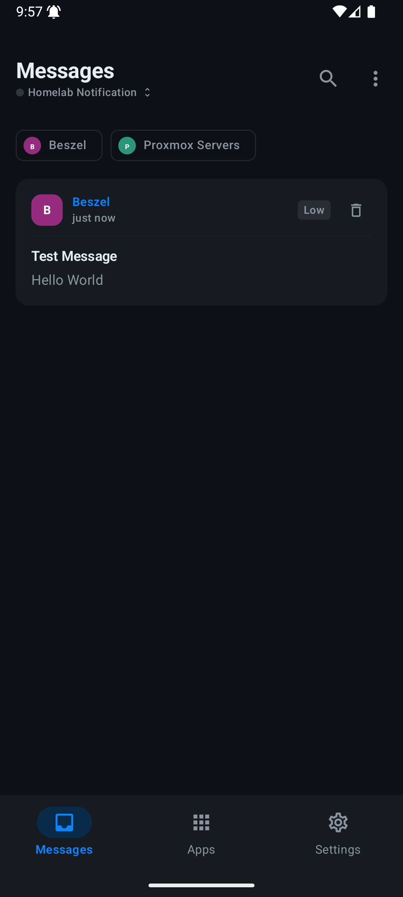
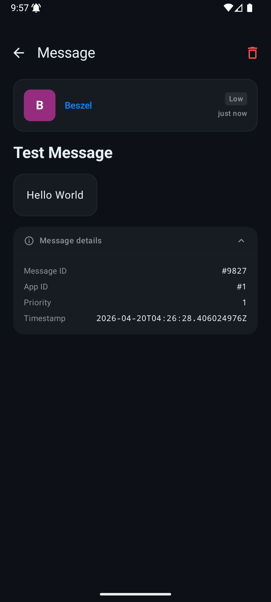
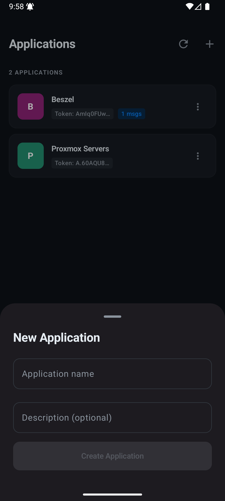

# Gotify+

A modern Android client for [Gotify](https://gotify.net/) — a self-hosted push notification server. Built entirely with Jetpack Compose and Material 3, Gotify+ replaces the official Android app with a cleaner interface, per-app notification channels, real-time WebSocket streaming, and offline message caching.

---

## Screenshots

<p align="center">
  
  
  
</p>

<p align="center">
  
  
  
</p>

## Features

- **Real-time notifications** via persistent WebSocket connection to `/stream`
- **Per-app notification channels** with Low / Normal / High priority tiers
- **Offline caching** — messages stored in Room DB, readable without network
- **Full-text search** across all cached messages
- **App inbox** — per-application message view
- **Markdown rendering** in message bodies
- **Action buttons** — tap extras from message payloads open URLs directly
- **Dark and light theme** with Material You dynamic color on Android 12+
- **Vibration control** — toggle independently from notification sound
- **Filter chips** — filter the message feed by application instantly
- **Pull-to-refresh** on both messages and applications screens
- **Battery optimization** — foreground service survives Doze with wake lock
- **Boot receiver** — listener service auto-restarts after device reboot

---

## Tech Stack

| Layer                | Library                      |
| -------------------- | ---------------------------- |
| UI                   | Jetpack Compose + Material 3 |
| Architecture         | MVVM + Clean Architecture    |
| Dependency Injection | Hilt                         |
| Networking           | Retrofit 2 + OkHttp 4        |
| Real-time            | OkHttp WebSocket             |
| Local DB             | Room                         |
| Preferences          | DataStore                    |
| Image loading        | Coil                         |
| Async                | Kotlin Coroutines + Flow     |
| Markdown             | compose-markdown             |

---

## Requirements

- Android 8.0+ (API 26)
- A running [Gotify server](https://gotify.net/docs/install)

---

## Setup

### Build from source

1. Clone the repository
   
   ```bash
   git clone https://github.com/your-username/gotify-plus.git
   cd gotify-plus
   ```

2. Open in Android Studio Hedgehog or newer

3. Sync Gradle — all dependencies resolve from Maven Central and JitPack

4. Build → Generate Signed APK, or run directly on a device / emulator

### Login

The app supports two authentication methods:

**Username & Password** — enters your Gotify credentials and the app creates a new client token automatically via `POST /client`.

**Client Token** — paste a pre-existing token from Gotify web UI → Clients.

Both methods verify the server is reachable before saving.

---

## Architecture

```
app/
├── data/
│   ├── api/          Retrofit interfaces, WebSocket manager, OkHttp client
│   ├── db/           Room database, DAOs, entity↔domain mappers
│   ├── datastore/    User preferences (DataStore)
│   ├── model/        Domain models, sealed ApiResult, StreamState
│   └── repository/   AuthRepository, MessageRepository, ApplicationRepository
├── di/               Hilt modules (NetworkModule, DatabaseModule)
├── notification/     Per-app channel management, priority→behaviour mapping
├── service/          GotifyListenerService (foreground), BootReceiver
└── ui/
    ├── appinbox/     Per-app message list
    ├── apps/         Application management screen
    ├── components/   Shared composables (AppIcon, MessageCard, ConnectionDot…)
    ├── detail/       Message detail with Markdown + action buttons
    ├── home/         Main message feed with filter chips
    ├── login/        Server URL + auth screen
    ├── navigation/   NavHost, bottom bar, route constants
    ├── search/       Full-text search with result highlighting
    ├── servers/      Server info sheet
    ├── settings/     Settings screen
    ├── theme/        Material 3 color schemes, priority colours
    └── viewmodel/    One ViewModel per screen + AppStartupViewModel
```

---

## Notification Priority Mapping

| Gotify priority | Android behaviour                            |
| --------------- | -------------------------------------------- |
| 0               | No notification                              |
| 1 – 3           | Silent (IMPORTANCE_LOW)                      |
| 4 – 7           | Sound (IMPORTANCE_DEFAULT)                   |
| 8 – 10          | Sound + optional vibration (IMPORTANCE_HIGH) |

---

## Gotify API Coverage

| Endpoint                           | Used for                             |
| ---------------------------------- | ------------------------------------ |
| `POST /client`                     | Create client token on login         |
| `DELETE /client/{id}`              | Revoke token on logout               |
| `GET /user/current`                | Validate manual token                |
| `GET /message`                     | Fetch + paginate all messages        |
| `DELETE /message/{id}`             | Delete single message                |
| `DELETE /message`                  | Delete all messages                  |
| `GET /application`                 | List applications                    |
| `POST /application`                | Create application                   |
| `DELETE /application/{id}`         | Delete application                   |
| `DELETE /application/{id}/message` | Clear app messages                   |
| `GET /stream`                      | WebSocket — real-time message stream |
| `GET /version`                     | Verify server reachability           |

---

## Permissions

| Permission                             | Reason                                |
| -------------------------------------- | ------------------------------------- |
| `INTERNET`                             | Server communication                  |
| `FOREGROUND_SERVICE`                   | Keep WebSocket alive in background    |
| `POST_NOTIFICATIONS`                   | Show push notifications (Android 13+) |
| `RECEIVE_BOOT_COMPLETED`               | Restart listener after reboot         |
| `REQUEST_IGNORE_BATTERY_OPTIMIZATIONS` | Reliable background delivery          |
| `VIBRATE`                              | High-priority notification vibration  |
| `WAKE_LOCK`                            | Keep connection alive during Doze     |

---

## Contributing

Pull requests are welcome. For major changes please open an issue first to discuss what you would like to change.

1. Fork the repository
2. Create a feature branch (`git checkout -b feature/my-feature`)
3. Commit your changes (`git commit -m 'Add my feature'`)
4. Push to the branch (`git push origin feature/my-feature`)
5. Open a Pull Request

---

## License

```
MIT License

Copyright (c) 2025

Permission is hereby granted, free of charge, to any person obtaining a copy
of this software and associated documentation files (the "Software"), to deal
in the Software without restriction, including without limitation the rights
to use, copy, modify, merge, publish, distribute, sublicense, and/or sell
copies of the Software, and to permit persons to whom the Software is
furnished to do so, subject to the following conditions:

The above copyright notice and this permission notice shall be included in all
copies or substantial portions of the Software.

THE SOFTWARE IS PROVIDED "AS IS", WITHOUT WARRANTY OF ANY KIND, EXPRESS OR
IMPLIED, INCLUDING BUT NOT LIMITED TO THE WARRANTIES OF MERCHANTABILITY,
FITNESS FOR A PARTICULAR PURPOSE AND NONINFRINGEMENT. IN NO EVENT SHALL THE
AUTHORS OR COPYRIGHT HOLDERS BE LIABLE FOR ANY CLAIM, DAMAGES OR OTHER
LIABILITY, WHETHER IN AN ACTION OF CONTRACT, TORT OR OTHERWISE, ARISING FROM,
OUT OF OR IN CONNECTION WITH THE SOFTWARE OR THE USE OR OTHER DEALINGS IN THE
SOFTWARE.
```

---

## Acknowledgements

- [Gotify](https://gotify.net/) — the self-hosted notification server this client connects to
- [Jetpack Compose](https://developer.android.com/jetpack/compose) — Android's modern UI toolkit
- [compose-markdown](https://github.com/jeziellago/compose-markdown) — Markdown rendering in Compose
- [Coil](https://coil-kt.github.io/coil/) — image loading